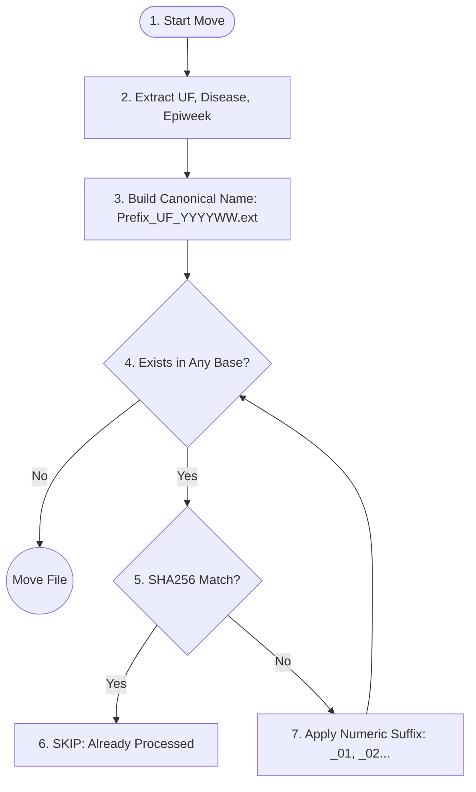

# Contributing to Ingestion

Technical details and operational procedures for maintaining the SINAN ingestion pipeline.

## System Dependencies

The ingestion system depends on several key Python libraries and external tools:
- **`watchdog`**: For the `PollingObserver` file-system watcher (essential for Docker compatibility).
- **`loguru`**: For structured, high-visibility logging.
- **`pandas` & `dbfread`**: For parsing CSV and DBF files.
- **`minio/mc`**: Used in the `minio-materializer` container for S3 mirroring.
- **`shlex`**: For secure shell command quoting (guards against filenames with special characters).

## Database & Migrations

The ingestion app uses dedicated models (`Run`, `SourceFormat`, etc.) to track processing history.

### Creating Migrations
If you modify `ingestion/models.py`, generate new migrations using:
```bash
python manage.py makemigrations ingestion
```

### Applying Migrations
Apply migrations to your target environment (ensure your `.env` is correctly configured):
```bash
python manage.py migrate
```

## Setup & Infrastructure

### 1. StorageBox Mount (/etc/fstab)
The Operational Source of Truth is the Hetzner StorageBox mounted at `/Storage2`. This mount MUST be accessible by the Celery workers.

**SSHFS Example:**
```text
# /etc/fstab
<user>@<user>.your-storagebox.de:/ /Storage2 fuse.sshfs _netdev,allow_other,IdentityFile=/root/.ssh/id_rsa,port=23 0 0
```

### 2. MinIO Deployment (Sugar)
Deploy the MinIO server and materializer (materializer) using **Sugar**:
```bash
sugar --profile staging compose-ext start --services minio -- -d
```

## Binary Data Naming & Collision Logic

When a file is moved from `/incoming` to `/Storage2`, the system applies a content-driven naming rule.



## Makim Operational Tasks

The ingestion watcher should be kept running for automated processing.

### Start/Restart Watcher
```bash
makim watch-start --env staging --replace
```

### Monitoring Process Status
```bash
makim watch-ps
```

### Stop Watcher
```bash
makim watch-stop --env staging
```

---
For a high-level overview of the data flow and Django Admin features, see [README.md](./README.md).
