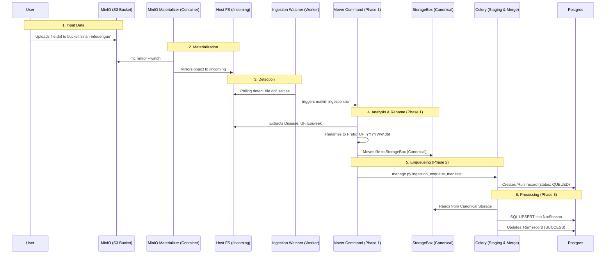
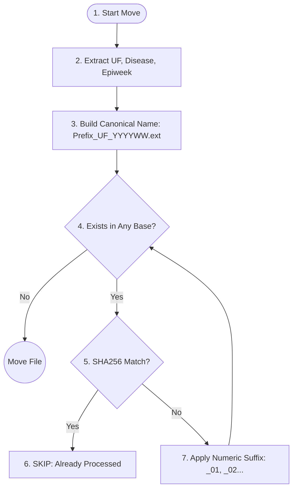

# SINAN Ingestion System

This application manages the multi-stage ingestion of SINAN (Sistema de Informação de Agravos de Notificação) data files into the AlertaDengue database. It is designed for high reliability, data integrity, and auditable processing.

## Architecture Overview

The ingestion process follows a structured path through several storage layers, prioritizing data correctness and recoverability.

| Layer | Type | Role |
| :--- | :--- | :--- |
| **MinIO** | Object Store | Ingress Gateway (Transient ingress) |
| **Incoming** | Local SSD | Watcher Buffer (Transient trigger) |
| **StorageBox** | Remote NAS | Canonical Repository (Permanent Hub) |
| **PostgreSQL**| Database | Final Data and Operations Metadata |

### Data Lifecycle Diagram

## Detailed Process

### 1. The Gateway (MinIO)
Data enters via MinIO. The `minio-materializer` container mirrors objects to a local `/incoming` folder. This bridge allows the filesystem watcher to work reliably on Docker-mounted volumes.

### 2. The Filter (Watcher & Moving)
The `ingestion_watcher.py` triggers the `mover_sinan_data.py` script. This is where file names become "official":
- **Canonical Naming**: Files are renamed based on **content** (Disease, UF, and Max Epiweek).
- **Collision & Versioning**: If a file for the same week already exists:
    - Same SHA256 Identity -> **Skip** (already processed).
    - Different Identity -> **Version** (e.g., `_01.dbf`, `_02.dbf`).
- **Canonical Destination**: Files are moved permanently to the **StorageBox** (mount point defined by `DOCKER_HOST_SINAN_ROOT`).

**Path Example**: `/mnt/storagebox-staging/sinan/raw_data/imported/es/dbf/dengue/2026/202611/DenInfodengue_ES_202611.dbf`

#### Binary Data Naming & Collision Logic

When a file is moved from `/incoming` to the StorageBox, the system applies a content-driven naming rule.

### 3. The Processor (Celery & Database)
The system creates a **Run** record for auditing and dispatches a Celery task.
- **Staging**: Data is bulk-inserted into a temporary `sinan_stage` table.
- **Merge**: Records are merged into `"Municipio"."Notificacao"` using an **UPSERT** logic to protect database consistency.

## Metadata & Auditing
Every ingestion is tracked in the **Django Admin** under the `Run` model:
- **Fingerprint**: SHA256 checksum prevents redundant work.
- **Metadata Blob**: Stores detected date formats, column mappings, and epidemiological week ranges.
- **Record Stats**: Counts of rows read, parsed, inserted, and updated are visible in real-time.

---
For technical setup, environment variables, and deployment via `sugar` or `makim`, see [CONTRIBUTING.md](./CONTRIBUTING.md).
