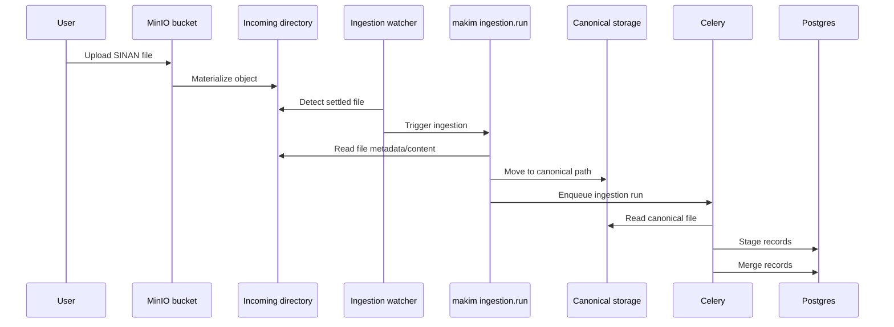

# SINAN Ingestion

This document describes the SINAN ingestion workflow used by AlertaDengue.

SINAN files are received through MinIO, materialized into a local incoming directory, detected by the ingestion watcher, moved to canonical storage, and processed asynchronously through Celery.

## Overview

```text
MinIO bucket
  -> incoming directory
  -> ingestion watcher
  -> makim ingestion.run
  -> canonical imported path
  -> Celery stage
  -> Celery merge
  -> Postgres
```

## Storage layers

| Layer | Role | Persistence |
| --- | --- | --- |
| MinIO | Object ingress gateway | Transient |
| Incoming directory | Local watcher buffer | Transient |
| StorageBox | Canonical imported file repository | Persistent |
| PostgreSQL | Final SINAN data and ingestion metadata | Persistent |

## Main locations

MinIO bucket:

```text
sinan-infodengue
```

Incoming directory watched by the ingestion watcher:

```text
/Storage/infodengue_data/sinan/incoming/
```

Canonical imported storage:

```text
/mnt/storagebox-infodengue/sinan/imported/
```

## Data lifecycle



## Canonical path format

Imported files are organized by country, file type, disease, year, and epidemiological week.

```text
{imported_root}/{country}/{file_type}/{disease}/{year}/{year}{epiweek}/{filename}
```

Production examples:

```text
/mnt/storagebox-infodengue/sinan/imported/br/csv/dengue/2026/202618/DenInfodengue_BR_202618.csv
/mnt/storagebox-infodengue/sinan/imported/br/csv/chik/2026/202618/ChikInfodengue_BR_202618.csv
```

## Disease mapping

| Disease | Folder | SINAN code | Filename prefix |
| --- | --- | --- | --- |
| Dengue | `dengue` | `A90` | `DenInfodengue` |
| Chikungunya | `chik` | `A92` | `ChikInfodengue` |

## Canonical filenames

Canonical filenames are generated from file content, not from the uploaded filename.

```text
DenInfodengue_{UF}_{YYYYWW}.{ext}
ChikInfodengue_{UF}_{YYYYWW}.{ext}
```

Examples:

```text
DenInfodengue_BR_202618.csv
ChikInfodengue_BR_202618.csv
```

The `{YYYYWW}` value is derived from the epidemiological week detected in the file.

## Processing phases

### Phase 1: move and manifest

The ingestion command reads the file, detects the disease, UF, year, epidemiological week, and file type, then moves the file to canonical storage.

If the destination already exists, the mover checks the file identity. Identical files are skipped. Different files for the same canonical period may be versioned with a numeric suffix.

This phase produces a manifest used by the enqueue step.

### Phase 2: enqueue

The manifest is passed to the Django ingestion enqueue command.

This step creates or reuses ingestion metadata and dispatches Celery work.

### Phase 3: stage and merge

Celery reads the canonical file and loads records into the staging layer.

After staging, records are merged into the final database tables using database-safe insert/update logic.

## Successful ingestion

Makim should finish with:

```text
DONE: enqueued=1 failed=0
```

Celery should complete the stage and merge tasks:

```text
Task ingestion.sinan_stage_run[...] succeeded
Task ingestion.sinan_merge_run[...] succeeded: {'inserted': ..., 'updated': ..., 'deleted': ...}
```

A successful merge result means the ingestion reached the database. You can check the status of the ingestion at https://info.dengue.mat.br/admin/ingestion/run/. You should see the ingestion with status 'successful' and the merge task with status 'succeeded' (the merge task will be listed under the 'Tasks' tab of the ingestion).
